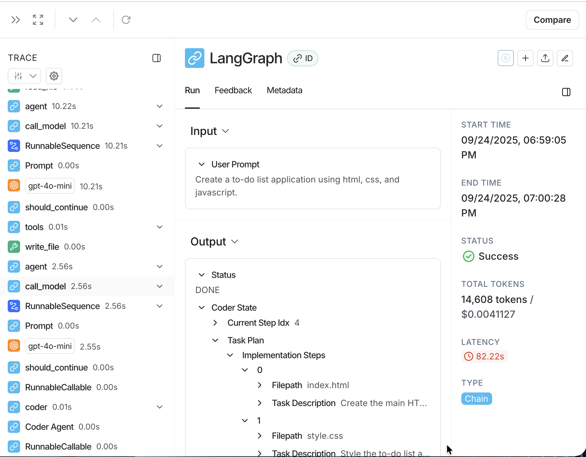
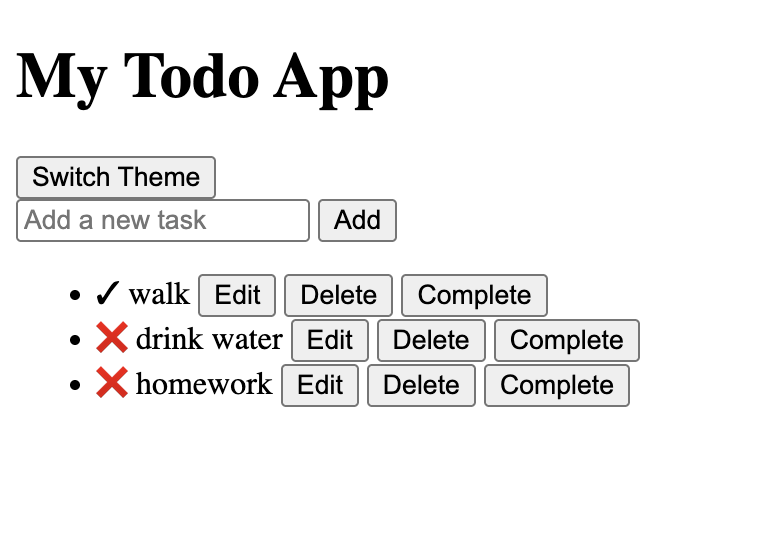

# AI-Powered Web Application Generator

This project is an AI-powered tool that automatically generates the frontend code for a web application based on a user's prompt. It uses a multi-agent system to plan, architect, and code the application.

## Description

The application takes a natural language description of a web application from the user. It then goes through a series of steps to generate the necessary HTML, CSS, and JavaScript files. The project is designed to be a demonstration of how AI can be used to automate frontend development tasks.

A key feature of this project is its integration with LangSmith for tracing and observability. This allows for detailed tracking of the entire generation process, from the initial user prompt to the final code output.

### LangSmith Trace


### Example Application


## Features

-   **AI-Powered Code Generation**: Leverages OpenAI's GPT-4o-mini to generate code.
-   **Multi-Agent Architecture**: The code generation process is broken down into a series of agents, each with a specific responsibility:
    -   **Planner Agent**: Takes the user's prompt and creates a high-level plan for the application.
    -   **Architect Agent**: Designs the file structure and tasks required to build the application.
    -   **Coder Agent**: Writes the actual HTML, CSS, and JavaScript code.
-   **LangSmith Integration**: The entire process is traced with LangSmith, providing visibility into the execution of each agent and tool. This is invaluable for debugging and understanding the AI's behavior.
-   **Dynamic Project Scaffolding**: Automatically creates a new directory for the generated project files.

## Technologies Used

-   **Python**: The core language for the agent-based system.
-   **LangChain & LangGraph**: For building the multi-agent system and managing the flow of execution.
-   **LangSmith**: For tracing, monitoring, and debugging the AI agents.
-   **OpenAI API**: For accessing the `gpt-4o-mini` model.
-   **Pydantic**: For data validation and settings management.
-   **dotenv**: For managing environment variables.

## Setup and Installation

1.  **Clone the repository:**
    ```bash
    git clone <your-repository-url>
    cd AutoSiteX
    ```

2.  **Create a virtual environment and activate it:**
    ```bash
    python -m venv venv
    source venv/bin/activate
    ```

3.  **Install the dependencies:**
    ```bash
    pip install -r requirements.txt
    ```

4.  **Configure your environment variables:**
    Create a `.env` file in the project root and add your API keys:
    ```
    OPENAI_API_KEY="your-openai-api-key"
    LANGCHAIN_API_KEY="your-langsmith-api-key"
    LANGCHAIN_TRACING_V2="true"
    LANGCHAIN_ENDPOINT="https://api.smith.langchain.com"
    LANGCHAIN_PROJECT="AutoSiteX"
    ```

## Usage

To run the application, execute the `main.py` script:

```bash
python main.py
```

You will be prompted to enter a description of the web application you want to create. For example:

```
Enter your project prompt: Build a colourful modern todo app in html css and js
```

The application will then generate the files in a new directory named after the project. You can monitor the entire process in your LangSmith project dashboard.
